<picture>
   <source media="(prefers-color-scheme: dark)" srcset="art/dar.svg">
   <source media="(prefers-color-scheme: light)" srcset="art/lig.svg">
   
</picture>

<picture>
  <source media="(prefers-color-scheme: dark)" srcset="dark.svg">
  <source media="(prefers-color-scheme: light)" srcset="light.svg">
  
</picture>

  <picture>
    <source media="(prefers-color-scheme: dark)" srcset="https://streak-stats.demolab.com?user=atharva-thakur24&theme=github-dark-blue&hide_border=true&card_width=1180&background=0D1117&stroke=00000000&ring=58A6FF&fire=FF6B6B&currStreakNum=58A6FF&sideNums=58A6FF&currStreakLabel=58A6FF&sideLabels=58A6FF&dates=8B949E&currStreakLabelSize=12&sideLabelsSize=11&datesSize=10&v=1" />
    <source media="(prefers-color-scheme: light)" srcset="https://streak-stats.demolab.com?user=atharva-thakur24&theme=ayu-light&hide_border=true&card_width=1180&background=00000000&stroke=00000000&currStreakLabelSize=12&sideLabelsSize=11&datesSize=10&v=1" />
    
  </picture>

<table width="100%" style="border: 1px solid transparent !important; border-collapse: collapse !important;">

  <tr style="border: 1px solid transparent !important;">

  <td
      width="55%"
      align="center"
      valign="middle"
      style="border: 1px solid transparent !important;"
    >

  <picture>
        <source
          media="(prefers-color-scheme: dark)"
          srcset="https://ghstats.dev/api/card?username=atharva-thakur24&theme=midnight&border_radius=13.5"
        />
   <source
          media="(prefers-color-scheme: light)"
          srcset="https://ghstats.dev/api/card?username=atharva-thakur24&theme=light&border_radius=13.5"
        />
 
   </picture>

  </td>

 <td
      width="45%"
      align="center"
      valign="middle"
      style="border: 1px solid transparent !important;"
    >
  <picture>
   <source
          media="(prefers-color-scheme: dark)"
          srcset="https://ghstats.dev/api/sparkline?username=atharva-thakur24&theme=midnight&days=30&width=330&height=143&title=Contribution+Graph"
        />
  <source
          media="(prefers-color-scheme: light)"
          srcset="https://ghstats.dev/api/sparkline?username=atharva-thakur24&theme=light&days=30&width=330&height=143&title=Contribution+Graph"
        />
 
      </picture>

   

 <picture>
        <source
          media="(prefers-color-scheme: dark)"
          srcset="https://ghstats.dev/api/langs?username=atharva-thakur24&theme=midnight&max_langs=5&layout=donut"
        />
   <source
          media="(prefers-color-scheme: light)"
          srcset="https://ghstats.dev/api/langs?username=atharva-thakur24&theme=light&max_langs=5&layout=donut"
        />
   
      </picture>
 </td>

  </tr>

</table>

<picture>
  <source
    media="(prefers-color-scheme: dark)"
    srcset="art/aboutdark1.svg"
  />
  <source
    media="(prefers-color-scheme: light)"
    srcset="art/aboutlight1.svg"
  />
  
</picture>

<picture>
  <source
    media="(prefers-color-scheme: dark)"
    srcset="art/prod.svg"
  />
  <source
    media="(prefers-color-scheme: light)"
    srcset="art/prol.svg"
  />
  
</picture>

### Languages and Tools

&nbsp;&nbsp;&nbsp;&nbsp;&nbsp;&nbsp;&nbsp;&nbsp;

&nbsp;&nbsp;&nbsp;&nbsp;&nbsp;&nbsp;&nbsp;&nbsp;

&nbsp;&nbsp;&nbsp;&nbsp;&nbsp;&nbsp;&nbsp;&nbsp;

&nbsp;&nbsp;&nbsp;&nbsp;&nbsp;&nbsp;&nbsp;&nbsp;

&nbsp;&nbsp;&nbsp;&nbsp;&nbsp;&nbsp;&nbsp;&nbsp;

&nbsp;&nbsp;&nbsp;&nbsp;&nbsp;&nbsp;&nbsp;&nbsp;

&nbsp;&nbsp;&nbsp;&nbsp;&nbsp;&nbsp;&nbsp;&nbsp;

