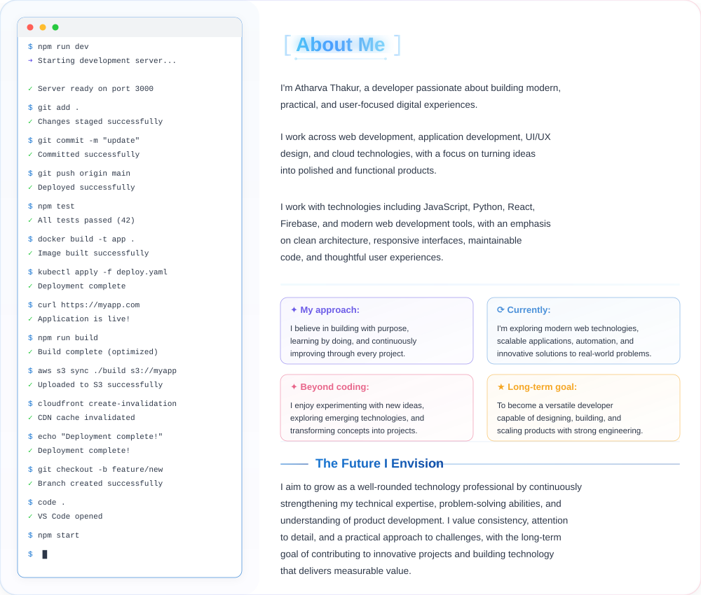

<picture>
   <source media="(prefers-color-scheme: dark)" srcset="art/dar.png">
   
</picture>

<picture>
  <source media="(prefers-color-scheme: dark)" srcset="dark.svg">
  <source media="(prefers-color-scheme: light)" srcset="light.svg">
  
</picture>

<picture>
<source media="(prefers-color-scheme: dark)" srcset="https://streak-stats.demolab.com/?user=atharva-thakur24&hide_border=true&background=0A101F&stroke=22D3EE&ring=A78BFA&fire=10B981&currStreakLabel=22D3EE&sideLabels=94A3B8&currStreakNum=F8FAFC&sideNums=F8FAFC&dates=64748B&titleColor=22D3EE&card_width=1180" /> 

<source
  media="(prefers-color-scheme: light)"
  srcset="https://streak-stats.demolab.com?user=atharva-thakur24&theme=solarized-light"
/>
   
   
</picture>

<table width="100%" style="border: 1px solid transparent !important; border-collapse: collapse !important;">

  <tr style="border: 1px solid transparent !important;">
    <td
      width="55%"
      align="center"
      valign="middle"
      style="border: 1px solid transparent !important;"
    >
   
    </td>

 <td
      width="45%"
      align="center"
      valign="middle"
      style="border: 1px solid transparent !important;"
    >
   

    

   
    </td>

  </tr>

</table>

<picture>
  <source
    media="(prefers-color-scheme: dark)"
    srcset="art/aboutdark.svg"
  />
  <source
    media="(prefers-color-scheme: light)"
    srcset="art/aboutlight.svg"
  />
  
</picture>

<picture>
   <source media="(prefers-color-scheme: dark)" srcset="art/header-dark.png">
   
</picture>

### Languages and Tools

&nbsp;&nbsp;&nbsp;&nbsp;&nbsp;&nbsp;&nbsp;&nbsp;

&nbsp;&nbsp;&nbsp;&nbsp;&nbsp;&nbsp;&nbsp;&nbsp;

&nbsp;&nbsp;&nbsp;&nbsp;&nbsp;&nbsp;&nbsp;&nbsp;

&nbsp;&nbsp;&nbsp;&nbsp;&nbsp;&nbsp;&nbsp;&nbsp;

&nbsp;&nbsp;&nbsp;&nbsp;&nbsp;&nbsp;&nbsp;&nbsp;

&nbsp;&nbsp;&nbsp;&nbsp;&nbsp;&nbsp;&nbsp;&nbsp;

&nbsp;&nbsp;&nbsp;&nbsp;&nbsp;&nbsp;&nbsp;&nbsp;

